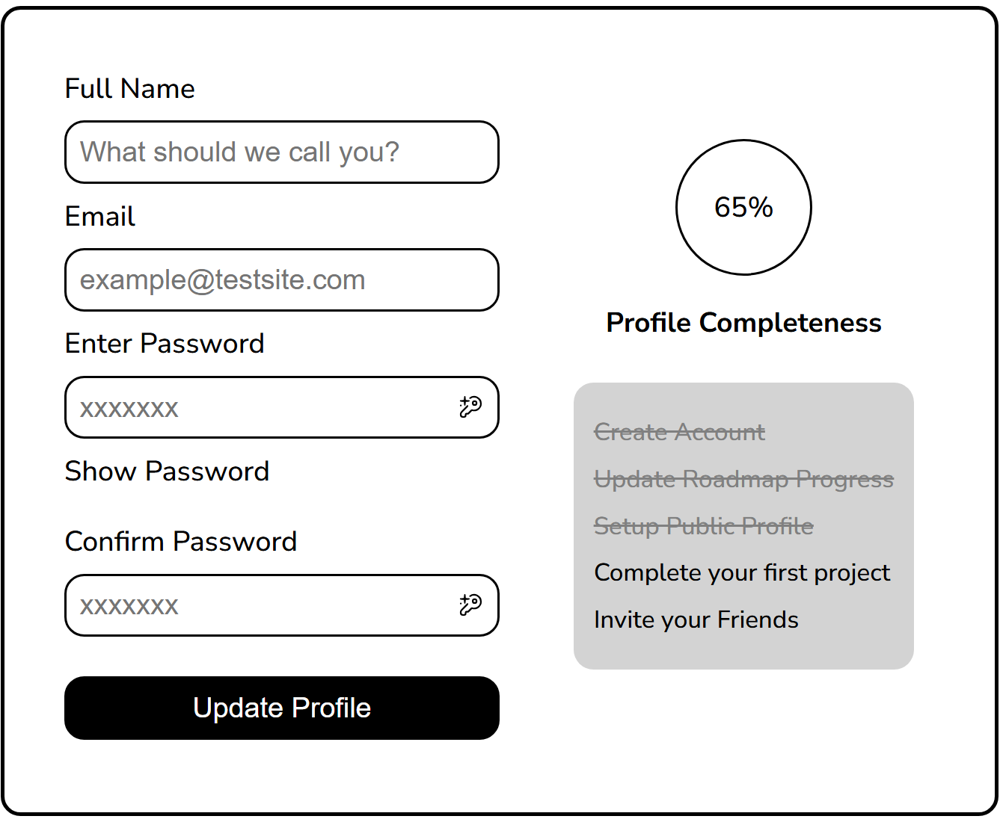
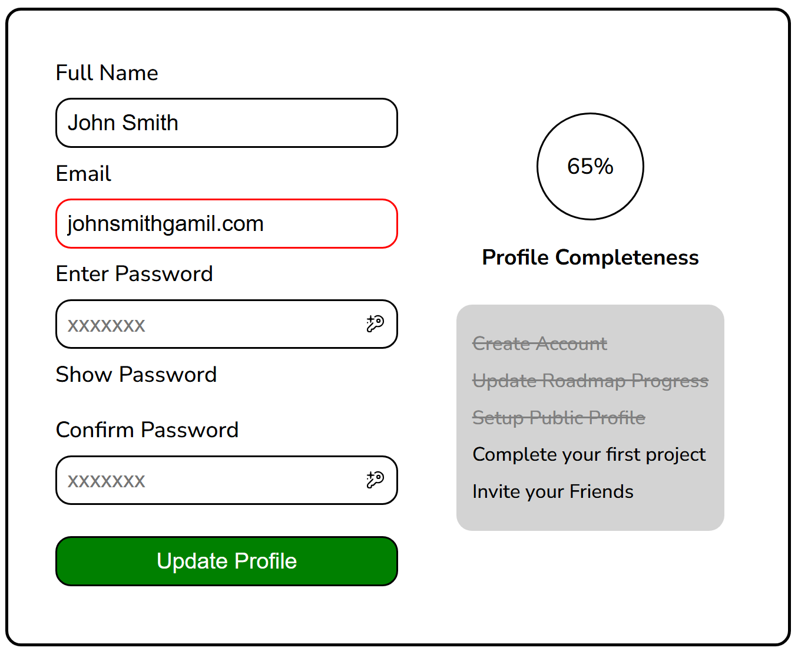

# Accessible Form UI
In this project the form UI will be created with using only HTML and CSS. The form will include fields for a full name, email, password, and confirm password, along with a button to toggle the visibility of the password text. Additionally, the form will feature a completeness progress bar and a checklist of requirements that must be met for the form to reach 100% 
completeness. While this version of the form won’t be functional, it will be a static UI component that can be enhanced with JavaScript in the future.

# Link to Roadmap.sh
https://roadmap.sh/projects/accessible-form-ui

# Objective of this Project
The goal of this project is to not only help with practice on HTML and CSS but also to focus on creating an accessible form that is easy to use for all users, including those with disabilities.

# Challenges
The biggest challenge for me was figuring out the accessible functions for this project.

# Screenshot
### Unsubmitted Form

### Submitted Form with Errors

